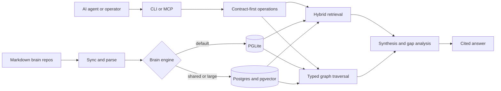

# GBrain

**Give the agent you already use a memory you control.** GBrain stores explicit facts with their sources, supports corrections and withdrawal, and makes the same memory available across your agents. Start with keyless memory and keyword retrieval; add semantic search, synthesis, and background enrichment when you need them.

**Keep skills beside knowledge.** New local brains include memory skills in their
content root. Agents can join an authorized catalog; only approved editors can
publish. Managed coding-agent installs add an owned native router; restart and
real-use verification are separate steps. Staged migration preserves sharing
choices and personal edits. See [shared brain skills](docs/guides/shared-brain-skills.md).

## Choose your setup

1. **Add GBrain to my existing agent — recommended.** Keep your agent's identity and save memory inside its environment. No new personal-agent identity or private repository is required. Start with the guide for **[Grok Bot](docs/guides/grok-bot.md)**, **[Muse](docs/guides/muse.md)**, or **[Codex / Claude Code](docs/tutorials/connect-coding-agent.md)**. [Other harnesses](#connect-gbrain-to-your-ai-client-mcp).
2. **Use the brain on my own computer from everywhere.** One command publishes it over MCP on your Tailscale tailnet and keeps it running: `gbrain mcp expose` (add `--funnel` for cloud agents such as Grok Bot, Muse and ChatGPT). Follow **[use your brain from anywhere over MCP](docs/guides/remote-mcp.md)**. **Say to your agent:** *"use my brain over mcp"* — *"put my brain on tailscale"*.
3. **Connect my existing hosted brain.** Follow **[hosted harness access](docs/guides/hosted-harness-access.md)** to choose native OAuth or a private machine connection. For dashboard login, clients, and permissions, use **[MCP administration](docs/mcp/ADMIN.md)** with the server's separate owner credential. Delegation is an explicit choice.

Grok **Bot** and Grok **Build** are different products. Muse's personal agent and **Muse Code** are different products too. Muse already has native editable memory; GBrain adds an explicit, portable record with provenance and shared access. See each guide's dated evidence and remaining verification steps.

I'm Garry Tan, President and CEO of Y Combinator. I built GBrain to run my own AI agents. It's the production brain behind my OpenClaw and Hermes deployments: **155,795 pages, 24,589 people, 5,340 companies**, 66 cron jobs running autonomously. My agent ingests meetings, emails, tweets, voice calls, and original ideas while I sleep. It enriches every person and company it encounters. It fixes its own citations and consolidates memory overnight. I wake up smarter than when I went to bed — and so will you.

**It works as a company brain too.** Authenticated remote clients are constrained by source and operation grants plus visibility filters. Local files and shared database credentials are a different trust boundary: sources alone do not isolate those callers. The authorization tests exercise specific access paths, not a universal no-leak guarantee. Read the [sharing boundaries](docs/architecture/brains-and-sources.md#what-confines-remote-callers-and-what-does-not) and [company-brain tutorial](docs/tutorials/company-brain.md) before setting up shared access.

Alongside keyword and semantic retrieval, GBrain offers two optional ways to use your stored knowledge:

- **A synthesis layer that gives you the actual answer.** Synthesized, well-cited prose across people, companies, deals, and ideas. Not "here are 10 chunks that mention your query"; an actual answer with citations and an explicit note on what the brain doesn't know yet. The gap analysis is the part that changes how you use the brain.
- **A typed knowledge graph.** Trusted local page writes extract supported references without LLM calls when auto-linking is enabled. Remote `put_page` does not extract graph edges inline: stdio has best-effort startup/idle sweeps; HTTP needs explicit maintenance or authorized `add_link` calls. Ask "who works at acme-example?" to use stored relationships. A 240-page Opus-generated rich-prose BrainBench run reported **P@5 49.1%, R@5 97.9%**, with **+31.4 points P@5** over its graph-disabled variant. These are scoped benchmark results, not a guarantee for every corpus. Scorecards: [gbrain-evals](https://github.com/garrytan/gbrain-evals).

The point of building a 150K-page brain is to use it as a strategic moat. To never lose context. To query what's in your own head without re-reading it. The brain layer is what makes the moat usable. The 24/7 dream cycle is what keeps it sharp. Both run on your hardware, your DB, your keys.

It's easier to ship a daemon that runs 24/7 to ingest, enrich, and consolidate than it is to keep an agent in chat working hard. GBrain is that daemon, generalized. Install in 30 minutes. Your agent does the work. As my personal agent gets smarter, so does yours.

> **Start keyless.** Your harness subscription and any separately configured model API usage are different costs. The optional personal-agent bootstrap takes about 15 minutes; always-on enrichment needs its own compute and API configuration.

Durable preferences and facts can be shared across agents; transient task and
harness configuration state stay local. Configured cloud embedding, reranking,
extraction, and synthesis providers can receive text, and the harness model sees
recalled memory even in keyless mode. Markdown export is not a full database
backup. Read [memory boundaries](docs/guides/memory-boundaries.md).

> **LLMs:** fetch [`llms.txt`](llms.txt) for the documentation map, or [`llms-full.txt`](llms-full.txt) for the same map with core docs inlined in one fetch. **Agents:** start with [`AGENTS.md`](AGENTS.md) (or [`CLAUDE.md`](CLAUDE.md) if you're Claude Code).

## What this looks like

Say you have a meeting with Alice tomorrow. You want to walk in remembering what she works on, when you last talked, and what's still open between you. Here's what you'd type, and what you'd get back.

**You ask:**

> "What do I need to know before my meeting with Alice tomorrow?"

**Most personal-knowledge tools give you back a list of pages.** Something like:

```
1. people/alice — Alice runs engineering at Acme...
2. meetings/2026-03-15-alice-q1 — Q1 product review with Alice...
3. meetings/2026-01-08-acme-kickoff — Kickoff meeting with Acme team...
4. customers/acme — Acme is a series-B fintech we work with...
5. notes/2026-04-22 — Quick chat with Alice about pricing...
```

Five pages you now have to open and read yourself to actually prepare. The tool found the right material, but it didn't do the work.

**GBrain gives you back the answer, with sources:**

```
Alice runs engineering at Acme (a series-B fintech). You last spoke
on April 22 in a quick pricing chat. Three things are still open
from that conversation:

1. She owes you the security review for the new tier
   (deadline was May 1; no update since).
2. You committed to pricing for a 500-seat tier
   (you sent it April 25; no response yet).
3. She mentioned they're hiring a CISO; you said you'd intro
   someone from your network.

Heads up: nothing's been added to the brain about Alice or Acme
since April 22, six weeks ago. She may have replied through email
or Slack DM, channels the brain doesn't see. Worth asking her to
catch up before assuming any of this is still current.
```

Every claim has a source page behind it. The "heads up" at the end tells you what the brain doesn't know yet, so you can ask Alice about it directly instead of being surprised. The brain just did your meeting prep.

This is the difference between a search engine and a brain. Search finds the pages. The brain reads them for you and writes the answer.

## Install

Requires **Bun 1.3.11 or newer**. Existing worker installations should follow the
[authorization and queue upgrade guide](docs/guides/authorization-upgrade.md)
before restarting services with this version.

> [!WARNING]
> **GBrain is NOT distributed on npm.** The npm package named `gbrain` is an unrelated
> package with no connection to this project. Do not run `npm install -g gbrain` or
> `bun add -g gbrain` — you'll get something else, and it can shadow the real binary on
> your PATH. Install and upgrade ONLY via the documented paths below
> (`bun install -g github:garrytan/gbrain`, or `git clone` + `bun install && bun link`).
> If you already ran the npm install by mistake: `npm uninstall -g gbrain` /
> `bun remove -g gbrain`, then reinstall from GitHub. `gbrain doctor` detects a
> shadowing npm install and prints the fix.

Start with the agent you already use. For Grok Bot and Muse, the dedicated guides above install an isolated launcher, repairable runtime, and memory in a verified persistent directory. For a coding agent, paste:

```text
Add GBrain memory to this existing agent. Read and follow:
https://raw.githubusercontent.com/garrytan/gbrain/master/INSTALL_FOR_AGENTS.md
Keep my current identity and instructions. Start keyless, preserve unrelated
configuration, and use the memory-only path. Do not create a personal-agent
identity or private repository. Show me the required search-mode choice.
Verify a unique remember/recall/correction/withdrawal round trip using observed
GBrain calls, then tell me how to verify recall in a new conversation.
```

[Codex guide](docs/mcp/CODEX.md) · [Claude Code guide](docs/mcp/CLAUDE_CODE.md) · [Memory-only walkthrough](docs/tutorials/connect-coding-agent.md) · [CLI standalone](#cli-standalone-no-agent).

The following bootstrap paths are optional: use them when you want GBrain to help create a **new persistent personal agent**, including identity files and a private repository.

### For Codex — optional personal-agent bootstrap

Turn Codex into your persistent personal agent. (Just want the brain + skills without the full agent? `codex plugin marketplace add garrytan/gbrain@codex-plugin` then `codex plugin add gbrain@gbrain` — see [docs/mcp/CODEX.md](docs/mcp/CODEX.md). The paste block below builds the whole agent.) Works in the **ChatGPT desktop app** (open Codex on a folder) and in the **Codex CLI** (`codex` in a terminal) — same install, same result. Open Codex in a **new, empty folder** (not an existing code project) — that folder becomes your agent's own **private GitHub repo**, which bootstrap creates and privacy-verifies for you. Then paste:

```
Read and follow every step of:
https://raw.githubusercontent.com/garrytan/gbrain/latest-stable/BOOTSTRAP_FOR_AGENTS.md
Goal: set yourself up as my persistent personal agent in this folder, with gbrain
as your memory. Interview me before writing any identity file — never invent
answers. Ask before anything destructive. You are not done until
`gbrain bootstrap verify` exits 0.
```

Bootstrap creates identity files from your answers, a local keyless brain, MCP
registration, and a private repository. Command approvals are normal. Verify a
saved fact in a fresh conversation; identity-file recall alone is not that test.
The repo is not a complete backup. For private-repo adoption, optional providers,
cloud behavior, and uninstall, read the [bootstrap guide](docs/guides/bootstrap.md).

### For Claude Code — optional personal-agent bootstrap

Works in the **desktop app** and in the **CLI** (`claude` in a terminal) — identical harness, identical result. Open Claude Code in a **new, empty folder** (not an existing code project) — that folder becomes your agent's own **private GitHub repo**, created and privacy-verified for you. Then paste the same block:

```
Read and follow every step of:
https://raw.githubusercontent.com/garrytan/gbrain/latest-stable/BOOTSTRAP_FOR_AGENTS.md
Goal: set yourself up as my persistent personal agent in this folder, with gbrain
as your memory. Interview me before writing any identity file — never invent
answers. Ask before anything destructive. You are not done until
`gbrain bootstrap verify` exits 0.
```

Claude Code also supports per-turn context and persistence hooks, with opt-outs.
A fresh-conversation recall test must observe actual GBrain calls, not infer the
source from the answer. See [bootstrap](docs/guides/bootstrap.md) for cloud setup,
private-repo adoption, hooks, recovery, and removal.

### For OpenClaw or Hermes — GBrain as intended, always on

This is GBrain used the way it was designed to be used: a server-hosted agent with 24/7 crons, continuous ingestion, and the overnight dream cycle that enriches your brain while you sleep — your agent works whether your laptop is open or not. It's also the highest-cost path: a deployed server (8GB+ RAM) plus raw API token usage that scales with how hard your agent runs, well beyond a chat subscription. Start here if you want the full experience from day one; start with Codex above if you want to feel it first. If you don't have a platform running yet, both deploy in one click:

- **[OpenClaw](https://github.com/openclaw/openclaw)** — deploy [AlphaClaw on Render](https://render.com/deploy?repo=https://github.com/chrysb/alphaclaw) (one click, 8GB+ RAM)
- **[Hermes](https://github.com/NousResearch/hermes-agent)** — deploy on [Railway](https://github.com/praveen-ks-2001/hermes-agent-template) (one click)

Then paste this into your agent:

```
Retrieve and follow the instructions at:
https://raw.githubusercontent.com/garrytan/gbrain/master/INSTALL_FOR_AGENTS.md
```

The agent starts with keyless memory and verifies it. API keys, automatic capture, paid enrichment, and the dream cycle are separate opt-in choices; the install prompt does not authorize all of them.

> **Never set up an AI agent platform before?** The [personal-brain tutorial](docs/tutorials/personal-brain.md) walks the whole path end-to-end — picking OpenClaw vs Hermes, deploying it, pointing it at INSTALL_FOR_AGENTS.md, getting the API keys, and verifying the first query. Start there if any of the above is new.

### Lighter ways in

**Just want a memory for your coding agent — no identity, no repo.** Spin up a local brain and connect it in two commands — zero server, zero token, zero tunnel. `--surface verbs` gives your agent the seven-verb memory protocol (`recall`, `remember`, `entity`, `synthesize`, `forget`, `context_pack`, `delta` — [MEMORY_VERBS v1](docs/protocol/MEMORY_VERBS_v1.md), frozen + additive-forever) instead of the full tool wall; drop the flag for every operation:

```bash
gbrain init --pglite --no-embedding                     # keyless local brain (no Docker)
claude mcp add gbrain -- gbrain serve --surface verbs   # or: codex mcp add gbrain -- gbrain serve --surface verbs
```

If `claude` is not found, install Claude Code first — or use the per-harness blocks in the [protocol doc](docs/protocol/MEMORY_VERBS_v1.md). Heads-up: memories agents save default to brain-wide visibility (every connected agent can recall them); pass `visibility: "private"` for local-only facts.

**Already have a brain on a remote host** (OpenClaw, Hermes, or any `gbrain serve --http`)? Point your laptop agents at it with one command each — `--install` wires it up and smoke-tests the token before handoff:

```bash
gbrain connect https://your-host/mcp --token gbrain_xxx --install               # Claude Code
gbrain connect https://your-host/mcp --token gbrain_xxx --agent codex --install # Codex
```

Onboarding a whole agent harness onto a shared brain? On the brain host, `gbrain agent register <name> --harness claude-code` mints a scoped OAuth client plus a 30-day token and prints the paste-ready wiring block — presets for daily-driver and write-isolated coding agents. The [onboarding decision table](docs/guides/agent-to-gbrain.md#onboarding-paths--the-decision-table) says which path fits.

**Brain-only install into another coding agent** (Cursor, Claude Cowork, or anything that can fetch a URL and run shell commands) — paste the OpenClaw/Hermes block above (`INSTALL_FOR_AGENTS.md`). It starts with keyless memory without replacing the agent's identity. Skills, automatic capture and the dream cycle are separate choices; verify activation in the intended harness.

**[→ Full walkthrough: give your coding agent a memory](docs/tutorials/connect-coding-agent.md)** — the memory-only paths end to end, plus the brain-first protocol you paste into `CLAUDE.md` / `AGENTS.md` and the four habits that make it actually change how you work.

### CLI standalone (no agent)

```bash
bun install -g github:garrytan/gbrain
gbrain init --pglite --no-embedding  # keyless; no server, no Docker
gbrain doctor            # verify health
gbrain import ~/notes/ --no-embed   # index your markdown
gbrain search "a phrase from a note" --json
```

Postgres-at-scale, Supabase, and thin-client setup paths live in [`docs/INSTALL.md`](docs/INSTALL.md).
For an existing keyless brain, follow the [memory-only upgrade path](docs/INSTALL.md#memory-only-upgrades)
to keep daemon installation and paid reindexing opt-in.

### Connect GBrain to your AI client (MCP)

For a hosted brain, start with the [native OAuth and private machine connection guide](docs/guides/hosted-harness-access.md). To open the dashboard, register clients, edit access, or invalidate tokens, use [MCP administration](docs/mcp/ADMIN.md). A **profile** controls MCP authority; a **surface** controls which granted tools are visible. Neither grants owner dashboard access. New memory profiles use the starter surface. `--surface verbs` retains exactly the seven memory verbs, with orientation available through `gbrain://capabilities`. Thin CLI connections use the full surface and remain restricted by their grants.

The existing connection commands below remain supported. Choose the instructions for your actual product:

**Upgrading an existing brain:** existing search chunks need rebuilding before
remote chunk retrieval resumes. Semantic result caching is temporarily disabled;
stored contradiction reports and code-inspection tools have local-only limits.
Follow the [upgrade recovery guide](skills/migrations/v0.48.3.0.md) for rebuild
commands, embedding costs, and the restrictions that remain after rebuilding.
**Say to your agent:** *"Upgrade gbrain and check whether my search index needs rebuilding."*

- **[Claude Code](docs/mcp/CLAUDE_CODE.md)** — plugin: `/plugin marketplace add garrytan/gbrain` + `/plugin install gbrain@gbrain` (MCP + skills; persona variants `gbrain-coding` / `gbrain-daily` install curated subsets — pick exactly one gbrain plugin). Marketplace-free skills: `gbrain skillpack scaffold --harness claude-code` copies a persona-curated skill set into your user-scope skills dir with a local-edit-respecting update lens. Or local one-liner: `claude mcp add gbrain -- gbrain serve` (zero server, zero tunnel). Remote with just a bearer token: `gbrain connect https://your-host/mcp --token gbrain_xxx` prints a paste-ready block (or `--install` wires it up and smoke-tests the token).
- **[Codex](docs/mcp/CODEX.md)** — plugin (recommended): `codex plugin marketplace add garrytan/gbrain@codex-plugin` + `codex plugin add gbrain@gbrain` installs the MCP server AND the curated skill set. Or connect-only: `gbrain connect https://your-host/mcp --token gbrain_xxx --agent codex` (or `--install`); That legacy path reads `$GBRAIN_REMOTE_TOKEN` at runtime. The new private-handoff installer writes a private managed HTTP header so the connection survives a new shell.
- **[Cursor / Windsurf / any stdio MCP client](docs/mcp/CLAUDE_CODE.md)** — same shape, add `{"command": "gbrain", "args": ["serve"]}` to your MCP config.
- **[Hermes](docs/mcp/HERMES.md)** — `printf 'Y\n' | hermes mcp add gbrain --env GBRAIN_HOME=$HOME --connect-timeout 60 --command $(which gbrain) --args serve`. Keep `--args` last, and verify with `hermes mcp test gbrain` (the add exits 0 even on failure).
- **[Grok Bot](docs/guides/grok-bot.md)** — recommended: keep the brain on your computer, publish it with `gbrain mcp expose --funnel`, grant the Bot a `memory-writer` client and install the thin CLI at `/workspace/gbrain`; or install memory inside the Bot computer when no machine of yours stays online. Bots share local files and credentials; sources organize memory without isolating Bots. **Say to your agent:** *"connect grok bot to my brain"*.
- **[Muse personal agent](docs/guides/muse.md)** — first verify its durable user-files location; then either connect it to your published brain (`gbrain mcp expose --funnel` + thin CLI) or install the local CLI there. Native MCP configuration and skill activation are not assumed. **Say to your agent:** *"connect muse to my brain"*.
- **[Grok Build](docs/mcp/GROK.md)** — `grok mcp add gbrain -e "GBRAIN_HOME=$HOME" -- gbrain serve --surface verbs`. The add is lazy (exit 0 without connecting) — verify with `grok mcp doctor gbrain`, which spawns the server and reports `7 tools discovered`. Verified against Grok Build v1.0.4.
- **[opencode](docs/mcp/OPENCODE.md)** (opencode.ai / SST — not OpenClaw) — `opencode mcp add gbrain --env GBRAIN_HOME=$HOME -- gbrain serve --surface verbs`, or let `gbrain bootstrap hooks --harness opencode` write the config for you (opencode is a bootstrap-supported harness — it reads AGENTS.md natively). The add is lazy — verify with `opencode mcp list`, which spawns the server (`✓ gbrain connected`). Remote: `gbrain connect https://your-host/mcp --token gbrain_xxx --agent opencode [--install]` — the config stores only the `{env:GBRAIN_REMOTE_TOKEN}` interpolation. Verified against opencode v1.18.18.
- **[OpenClaw](docs/mcp/OPENCLAW.md)** — the ClawHub bundle plugin registers gbrain automatically (`openclaw.plugin.json` ships in this repo), or register the stdio server with `openclaw mcp add gbrain --command "$(command -v gbrain)" --arg serve --env GBRAIN_HOME=$HOME` (absolute path: the launchd gateway PATH lacks `~/.bun/bin`); verify with `openclaw mcp list`.
- **[Claude Desktop (Cowork)](docs/mcp/CLAUDE_DESKTOP.md)** — Settings → Integrations → add the URL of your HTTP server. Remote only; the local `claude_desktop_config.json` does not work for remote servers.
- **[Claude Cowork (team plan)](docs/mcp/CLAUDE_COWORK.md)** — org Owner adds the connector under Organization Settings → Connectors.
- **[Perplexity Computer](docs/mcp/PERPLEXITY.md)** — choose native OAuth or a managed bearer connection according to the actual connector settings. The owner registers the matching client and delivers any confidential credentials privately.
- **[ChatGPT](docs/mcp/CHATGPT.md)** — native OAuth with PKCE. Register the exact callback and token authentication method shown in its MCP settings, then start the connection in ChatGPT and complete owner consent.

For the HTTP server itself:

```bash
gbrain serve              # stdio MCP (local subprocess; for Claude Code, Cursor, Windsurf)
gbrain serve --http       # HTTP MCP with OAuth 2.1 + admin dashboard at /admin
                          # (required for Claude Desktop, Cowork, Perplexity, ChatGPT)
gbrain mcp expose         # publish serve --http on your Tailscale tailnet with HTTPS + a user service
gbrain mcp expose --funnel  # same name, public HTTPS — for agents that run in a vendor's cloud
```

`gbrain mcp expose` is the recommended way to run the server from your own computer: it installs Tailscale if needed (after a consent prompt), signs in, publishes the server on `https://your-machine.your-tailnet.ts.net/mcp`, keeps the admin token in a private file, installs a launchd / systemd user service, and prints separate owner-login, native OAuth, and machine-client next steps (`--status` re-checks, `--remove` undoes only its own changes). Local coding agents on the same machine: `gbrain bootstrap harness --yes --port 3131` on a Postgres brain; on PGLite mint a token before the service runs (`gbrain auth create local-agents --scopes read,write`) and pass `--token`, or grant a scoped client through the running server (`gbrain mcp grant … --admin-token-file ~/.gbrain/serve/admin-token`). Tailnet-only by default; `--funnel` is the explicit opt-in for cloud agents. **Say to your agent:** *"use my brain over mcp"* — *"reach my brain from my phone"*. Guide: [use your brain from anywhere over MCP](docs/guides/remote-mcp.md).

The HTTP server includes optional dynamic client registration, scope-gated access (`read` / `write` / `admin` / `agent`), owner-approved OAuth authorization, and rate limiting. Dynamic registration cannot grant delegation; `admin` implies neither `agent` nor owner administration. Start with the [MCP task guide](docs/mcp/README.md) for deployment, client setup, administration, and alternatives to Tailscale (ngrok, Railway, Fly.io).

Running several brains behind one tool catalog? Give each one an identity: `gbrain config set mcp.instructions "Team wiki brain — route product and roadmap questions here"` rides every transport's initialize response under a `Deployment identity:` banner, so a connected agent can tell your brains apart. Restart `gbrain serve` to pick it up; `GBRAIN_MCP_INSTRUCTIONS` in the serve process's environment overrides it for that process, and `gbrain config unset mcp.instructions` returns to the bare contract. **Say to your agent:** *"Tell connected agents which brain this is"* — your agent runs `gbrain config set mcp.instructions "<identity>"`.

## Two ways to query your brain

Raw retrieval (what most personal-knowledge tools ship) and a synthesis layer that gives you an actual answer. They serve different jobs.

```bash
# raw retrieval: top pages by hybrid score, no answer-generation call
gbrain search "who's working on AI agents at portfolio companies?"

# brain layer: synthesized answer with citations and gap analysis
gbrain think "who's working on AI agents at portfolio companies?"
```

**`gbrain search`** returns the top retrieved pages, ranked by hybrid scoring (vector + keyword + RRF + source-tier boost + reranker). Use it when you want raw material to skim: agent context windows, citation lookups, finding a specific quote.

Configured embedding and reranking providers can still receive text and charge
for retrieval. Keyless keyword search needs no model API; synthesis requires a
configured chat capability. See [memory boundaries](docs/guides/memory-boundaries.md#where-text-goes).

Search also tells you when its results are incomplete because projections are
still rebuilding or a bounded vector scan ran short. Ask your agent *"Check
whether my search index is ready"*; see [search readiness and recovery](docs/architecture/RETRIEVAL.md#chunk-rebuilds-after-upgrading)
before treating an empty result as proof that a page is missing.

**`gbrain think`** runs the same retrieval, then composes a synthesized answer across the results with explicit citations to the source pages AND an honest note on what the brain doesn't know yet. The gap analysis is the differentiator: the answer tells you when a page is stale, when a claim is uncited, when two pages contradict each other, when there's a hole you should fill.

**Say to your agent:** *"What do we know about acme-example?"* — *"Tell me about alice-example before my meeting tomorrow"* — *"Search for who's working on AI agents."* Your agent routes these to the brain automatically; you never type the commands yourself.

**Why it compounds.** Pair the brain layer with `find_trajectory` and you get answers like *"how have the company's metrics changed AND what does the team look like right now AND what did they promise / share AND when did we last meet AND what's the value-add I can offer here"*: well-scored, well-cited, in one shot. That's the strategic moat. That's why building a 150K-page brain is worth the effort.

`gbrain agent run "..."` exposes the same surface to a sub-agent through the Minions queue, with crash-safe two-phase persistence. Same answers, durable.

## How to get data in

Start with an explicit fact or a notes folder; opt into connectors, capture, and enrichment separately.

**Already have a company knowledge repository?** Say to your agent: *“Connect our
existing company brain, preserve its files, and show me the import plan first.”*
Try `gbrain sources demo company-brain` without keys or private data, then inspect
your committed Markdown with `gbrain sources inspect <path> --profile company-brain`.
The [company-brain ingestion guide](docs/guides/company-brain-ingestion.md) covers
explicit destination approval, typed relationships, and resumable verification.
It does not enable embeddings, sharing, schedules, or curation automatically.

**Say to your agent:** *"Remember this with its source"* — *"What should I import first?"*

[Data ingestion guide](docs/guides/data-ingestion.md) covers files, conversations, connectors, Google data, and capture commands.

## Your brain's shape (schema packs)

Most personal-knowledge tools force one fixed layout: their idea of "notes" + "people" + "tags." Drop a Notion export or your own years-old Obsidian vault on top, and the agent doesn't know what a `Projects/` folder means or whether `Reading/` is people or sources.

**gbrain doesn't have a fixed layout.** It ships with bundled schema packs and lets you author your own when none fit:

- **`gbrain-base-v2`** (default) — 15-type DRY/MECE canonical taxonomy (14 canonical + `note` catch-all): `person`, `company`, `media`, `tweet`, `social-digest`, `analysis`, `atom`, `concept`, `source`, `deal`, `email`, `slack`, `writing`, `project`, `note`. Subtypes/format/origin pushed to frontmatter.
- **`gbrain-base`** (legacy) — the wider 24-type layout. Stays bundled for back-compat; brains on it can upgrade via `gbrain onboard --check --explain` → `gbrain jobs submit unify-types --params '{"target_pack":"gbrain-base-v2","apply":true}'` (omit `"apply":true` for a dry-run preview — that is the default).
- **`gbrain-recommended`** — extends `gbrain-base` with the 13 additional directories from `docs/GBRAIN_RECOMMENDED_SCHEMA.md` (source, place, trip, conversation, personal, civic, project, etc.). Activate with `gbrain schema use gbrain-recommended`.
- **Your own pack** — `gbrain schema detect` clusters your actual filesystem into proposed types, `gbrain schema suggest` runs an LLM pass over them, and `gbrain schema review-candidates --apply` promotes the ones you like. Three commands and the brain knows your shape. Authoring a successor pack (declares `migration_from:` so existing brains can opt in): see [`docs/architecture/pack-upgrade-mechanism.md`](docs/architecture/pack-upgrade-mechanism.md).

```bash
gbrain schema active                # which pack is running, which tier set it
gbrain schema list                  # bundled + installed packs
gbrain schema detect                # propose types matching your filesystem
gbrain schema suggest               # LLM-refined proposals on top of detect
gbrain schema review-candidates     # human gate: promote / rename / ignore
gbrain schema use my-pack           # activate
```

**Say to your agent:** *"My schema isn't matching my notes — propose new types from my corpus"* — *"Add a page type for lab results to my brain's schema."* The schema-author skill runs the detect → suggest → review flow for you.

The active pack threads through every read + write path: `parseMarkdown` infers page type from the pack's path prefixes; `whoknows` scopes expert routing to types declared `expert_routing: true`; `extract_facts` runs only on `extractable: true` types. The retained search-cache key includes the pack name + version, but semantic result reuse is temporarily disabled. Switch packs and the brain re-interprets itself; switch back and nothing's lost.

Seven-tier resolution chain (per-call flag → env var → per-source DB key → brain-wide DB key → `gbrain.yml` → `~/.gbrain/config.json` → `gbrain-base` default). Full reference + authoring guide: [`docs/architecture/schema-packs.md`](docs/architecture/schema-packs.md).

## Tutorials

Step-by-step walkthroughs for getting the most out of GBrain. Each one takes you from zero to a working outcome, with concrete commands and real numbers.

- [**Set up your personal AI agent + brain from zero**](docs/tutorials/personal-brain.md) — the canonical full-stack install. Two GitHub repos, a Telegram bot, AlphaClaw on Render, OpenClaw + GBrain + Supabase. End-to-end in about 2 hours.
- [**Set up GBrain as your company brain**](docs/tutorials/company-brain.md) — federated, multi-user, OAuth-scoped institutional memory for a 10-50 person team. About 90 minutes end-to-end.
- [**Auto-improve a skill with `gbrain skillopt`**](docs/tutorials/improving-skills-with-skillopt.md) — treat a `SKILL.md` as a trainable parameter. Generate a starter benchmark straight from the skill with `--bootstrap-from-skill` (or write your own), strengthen the judges, then watch the optimizer propose edits and keep only the ones that measurably score higher. ~20 minutes, ~$1 in API calls. Flag + cost + safety reference: [`docs/guides/skillopt.md`](docs/guides/skillopt.md).

More walkthroughs in progress: connecting an existing agent (Claude Code, Cursor, OpenClaw, Hermes) to a GBrain memory layer; setting up GBrain for VC dealflow with founder scorecards and meeting prep; migrating an existing Notion or Obsidian vault; indexing a codebase as a queryable code brain. Full tutorial index: [`docs/tutorials/`](docs/tutorials/).

Want to see a tutorial that isn't here yet? [Open an issue](https://github.com/garrytan/gbrain/issues) describing the workflow you want documented.

## What it does (the loop)

```
  signal   →   search   →   respond   →   write   →   auto-link   →   sync
  (every    (brain-first  (informed     (page +    (typed edges     (cron
  message)  retrieval)    by context)   timeline)  + backlinks)     keeps fresh)
```

- **Signal detector**, after you opt in, captures durable ideas and entity mentions from substantive messages. Explicit remembering works without automatic capture; paid enrichment is a separate choice.
- **Brain-first lookup** before any external API call. The cheapest, fastest, most personal information source you have.
- **Auto-link** extracts graph links for trusted local page writes. No LLM calls; pure pattern matching on page references such as `[[people/alice-example]]`. Unresolved extracted facts keep their provenance without inventing a backing page.
- **Cron-driven enrichment** runs while you sleep: dedup people pages, fix citations, score salience, find contradictions, prep tomorrow's tasks.

The whole loop is described in [`docs/architecture/topologies.md`](docs/architecture/topologies.md) with diagrams.

**Say to your agent:** *"Set up autopilot"* (installs the cron that runs the loop) — *"Run dream"* — *"Did the dream cycle run?"*

## Capabilities

GBrain combines keyword and semantic retrieval, typed graph traversal, optional cited synthesis, background jobs, and curated agent skills.

**Say to your agent:** *"What search mode am I running?"* — *"Who works at acme-example?"* — *"What does my brain know about this project?"*

[Capability reference](docs/guides/capabilities.md) keeps the commands, benchmark scope, cost controls, and feature-specific guides.

## Integrations

Data flowing into the brain. Each integration is a recipe — markdown + setup hints — that ships in `recipes/` and is discoverable via `gbrain integrations list`. **Say to your agent:** *"Set up voice calls into my brain"* — *"Wire my email and calendar into the brain"* — your agent reads the recipe and walks the setup with you.

- **Voice**: Phone calls create brain pages via Twilio + OpenAI Realtime (or DIY STT+LLM+TTS). Setup recipe: [`recipes/twilio-voice-brain.md`](recipes/twilio-voice-brain.md).
- **Gmail + Calendar + Contacts (native)**: the google source kind syncs threads, events, and contacts through your own OAuth client and runs the open-loop engine on top (`gbrain waiting`). Setup: [`docs/guides/google-connect.md`](docs/guides/google-connect.md); recipes: [`recipes/email-to-brain.md`](recipes/email-to-brain.md), [`recipes/calendar-to-brain.md`](recipes/calendar-to-brain.md).
- **Email + calendar (webhooks)**: webhook handlers that route to brain signals. [`docs/integrations/meeting-webhooks.md`](docs/integrations/meeting-webhooks.md).
- **Embedding providers**: a dozen providers covered — Voyage (default: `voyage-4` @ 1024d), OpenAI, OpenRouter, Google Gemini, Azure OpenAI, MiniMax, Alibaba DashScope, Zhipu, Ollama (local), llama.cpp llama-server (local), LiteLLM proxy, plus ZeroEntropy (deprecated — hosted API ends 2026-09-04). Pricing matrix + decision tree in [`docs/integrations/embedding-providers.md`](docs/integrations/embedding-providers.md).
- **Rerankers**: Voyage `rerank-2.5` hosted (the default; reranking is on in `balanced` and `tokenmax` modes, same `VOYAGE_API_KEY` as embeddings; the preview `rerank-3` / `rerank-3-lite` are selectable with `gbrain config set search.reranker.model voyage:rerank-3`), ZeroEntropy `zerank-2` (deprecated — hosted API ends 2026-09-04; an explicit config short-circuits past that date), plus the `llama-server-reranker` recipe for fully-local cross-encoder rerank via llama.cpp — runs Qwen3-Reranker or self-hosted zerank weights against the same `gateway.rerank()` seam. Setup walkthrough in [`docs/ai-providers/llama-server-reranker.md`](docs/ai-providers/llama-server-reranker.md).
- **Credential vault + gateway**: `gbrain creds` manages OAuth and API credentials in a local vault ([`recipes/credential-gateway.md`](recipes/credential-gateway.md)); agent-side vault-aware secret distribution: [`docs/integrations/credential-gateway.md`](docs/integrations/credential-gateway.md).
- **MCP clients**: every major MCP client is supported. [`docs/mcp/`](docs/mcp/) per-client setup.
- **Memorable (procedural memory)**: optional, off by default. Your brain remembers *what* happened; Memorable makes your agent remember *how* — finished sessions become replayable procedures stored on your machine (in a standalone local store, or inside your brain database if you opt in), recalled when a similar task comes back. See the section below, and [`docs/memorable-agents.md`](docs/memorable-agents.md) for the agent-facing detail.

### Memorable — remember how, not just what (optional)

Memorable stores replayable procedures from coding sessions. Its relay is off by
default and requires an explicit disclosure/consent step; it can send redacted
traces and query text off-machine. Read the [Memorable integration guide](docs/memorable-agents.md)
for installation, data flow, per-harness limitations, and removal.

**Say to your agent:** *"Explain Memorable's data sharing before enabling it."*

## Architecture



**Two engines, one contract.** PGLite (Postgres 17 via WASM, zero-config, default) for personal brains up to ~50K pages. Postgres + pgvector (Supabase or self-hosted) for shared / large / multi-machine deployments. The contract-first `BrainEngine` interface in [`src/core/engine.ts`](src/core/engine.ts) defines the 140+ methods both engines implement; CLI and MCP server are generated from one source.

**Canonical files preserve file-backed knowledge.** Your brain repo holds Markdown that GBrain indexes for retrieval; deletes in git become soft-deletes in the database. DB-only pages, unresolved facts, revision history, and operational state need a separate database backup. See the [system-of-record contract](docs/architecture/system-of-record.md). You can publish public subsets, share team mounts, and run thin-client setups pointing at a colleague's brain server. Topologies in [`docs/architecture/topologies.md`](docs/architecture/topologies.md).

**Two organizational axes (brain ⊥ source).** A *brain* is a database (your personal brain, a team mount you joined). A *source* is a repo inside that brain (wiki, gstack, an essay, a knowledge base). Routing lives in `.gbrain-source` dotfiles and resolves via a documented 6-tier precedence chain. Full diagrams in [`docs/architecture/brains-and-sources.md`](docs/architecture/brains-and-sources.md).

**Why the graph matters.** Vector search finds semantic similarity; graph retrieval follows stored relationships. Extracted edges are evidence to inspect, not proof that a relationship is true. Graph freshness depends on the write path and maintenance described in [memory boundaries](docs/guides/memory-boundaries.md#page-writes-and-the-graph-are-separate-outcomes). Deep dive: [retrieval architecture](docs/architecture/RETRIEVAL.md).

## Troubleshooting

Start with `gbrain doctor`. For database access failures, use `gbrain engine status --probe` and `gbrain db-repair` before changing configuration.

**Say to your agent:** *"Check my brain health and show me the repair plan before changing anything."*

[Troubleshooting reference](docs/guides/troubleshooting.md) covers installation recovery, PGLite startup, embedding dimensions, locks, import failures, and sync.

## Docs

- [`docs/INSTALL.md`](docs/INSTALL.md) — every install path, end to end
- [`docs/guides/bootstrap.md`](docs/guides/bootstrap.md) — the persistent-personal-agent bootstrap contract (interview, identity files, hooks, private repo, security posture, uninstall), plus local harness mode (`gbrain bootstrap harness`) for wiring framework-spawned Claude Code/Codex sessions to a running serve
- [`docs/what-schemas-unlock.md`](docs/what-schemas-unlock.md) — why schemas matter: 7 killer use cases, the structural argument for typed page kinds, the agent-co-curates pattern
- [`docs/schema-author-tutorial.md`](docs/schema-author-tutorial.md) — 5-minute walkthrough: fork the bundled pack, add a custom type, backfill existing pages, prove the wiring via `gbrain whoknows`
- [`docs/architecture/`](docs/architecture/) — system design, topologies, retrieval theory
- [`docs/guides/`](docs/guides/) — how-to runbooks (google connect, open loops, sub-agent routing, minion deployment, skill development, brain-first lookup, idea capture, diligence ingestion)
- [`docs/integrations/`](docs/integrations/) — connecting external data sources (voice, email, calendar, embedding providers)
- [MCP task guide](docs/mcp/README.md) — deployment and per-client setup (Claude Desktop, Code, Cursor, ChatGPT, Perplexity, Cowork)
- [MCP administration](docs/mcp/ADMIN.md) — owner dashboard access, client registration, OAuth, permissions, and token recovery
- [`docs/eval/`](docs/eval/) — eval framework, metric glossary, methodology
- [`docs/ethos/`](docs/ethos/) — philosophy (thin harness, fat skills, markdown as recipes, origin story)
- [`AGENTS.md`](AGENTS.md) — entry point for non-Claude agents
- [`CLAUDE.md`](CLAUDE.md) — entry point for Claude Code (deep operating context)
- [`CONTRIBUTING.md`](CONTRIBUTING.md) — contributor guide, test discipline, eval-capture mode
- [`SECURITY.md`](SECURITY.md) — install-path trust model, self-update integrity, automated scanning, OAuth threat model, hardening defaults

## Contributing

Run `bun run test` for the fast loop, `bun run verify` for the pre-push gate, `bun run ci:local` to run the full Docker-backed CI stack locally. Detailed test discipline in [`CONTRIBUTING.md`](CONTRIBUTING.md).

Community PRs are batched into release waves rather than merged one-by-one — see the community-PR-wave process in [`docs/RELEASING.md`](docs/RELEASING.md). Contributor attribution stays attached via `Co-Authored-By:` trailers. We credit every accepted contribution in [`CHANGELOG.md`](CHANGELOG.md).

If you find a bug or want a feature: open an issue first. Quick fixes (typo, doc bug, obvious regression) can go straight to a PR. Anything touching schema, retrieval ranking, MCP protocol, or the security boundary needs a design discussion in the issue first.

## License + credit

MIT. I built GBrain to run my OpenClaw and Hermes deployments — the production brain behind my AI agents.

Origin story: [`docs/ethos/ORIGIN.md`](docs/ethos/ORIGIN.md).

Community PR contributors are credited in `CHANGELOG.md` per release. ZeroEntropy ([@zeroentropy](https://zeroentropy.dev)) for the ZeroEntropy embedding + reranker integration. Voyage AI for the asymmetric-encoding recipe template. Ramp Labs for the search quality improvements lineage.
